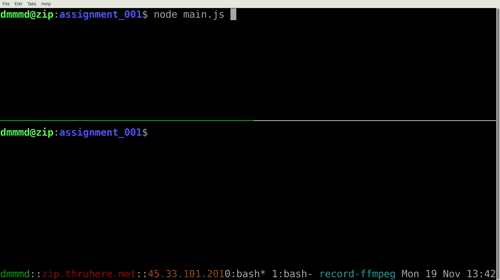

##########################################
Master NodeJS Class Homework Assignment #1
##########################################

This repository contains my submission for the`the NodeJS Master Class_` homework assignment #1.

To run the server:

.. code-block:: shell

   node main.js

An HTTP server running on localhost:3000 will start.

The server accepts only ``POST`` requests with an optional x-www-form-urlencoded payload.

The server as the following end points:

* hello 

  If a payload with a key of "name", "Hello, {name}!" is returned with a key of "greeting".

  Other wise "Hello!" is returned with a key of "greeting".

* reverse

  This endpoint takes a payload with key value pairs. And object is returned with the values reversed.

  Its key is "data".

All endpoints also return error, warning, header, and method information.

To see example output, start the server and then execute the following shell script:

.. code-block:: shell

   . ./test-with-curl.sh
   

.. _`the NodeJS Master Class`: https://pirple.thinkific.com/courses/the-nodejs-master-class
